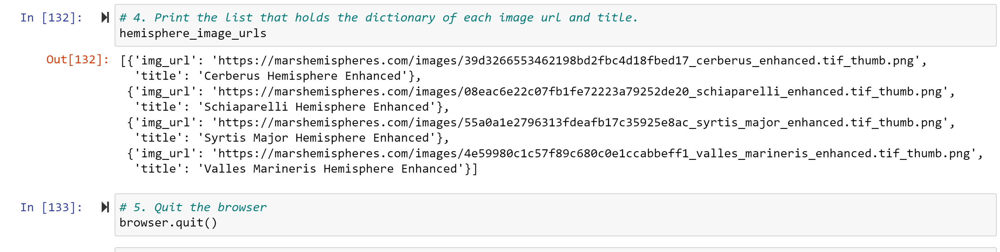
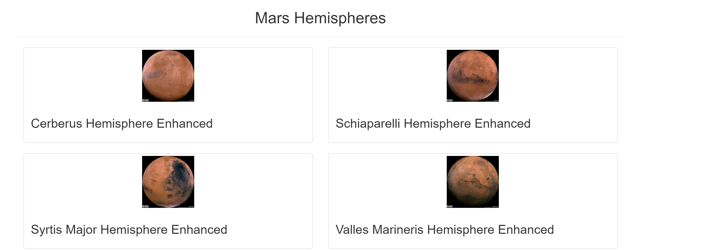
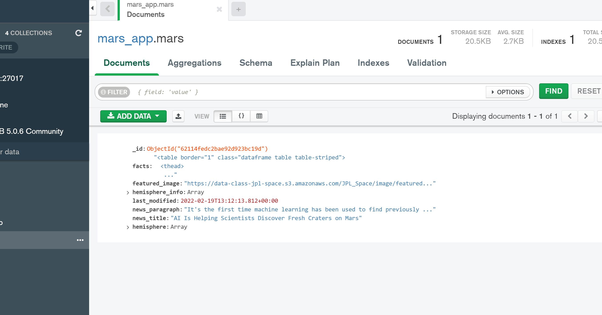
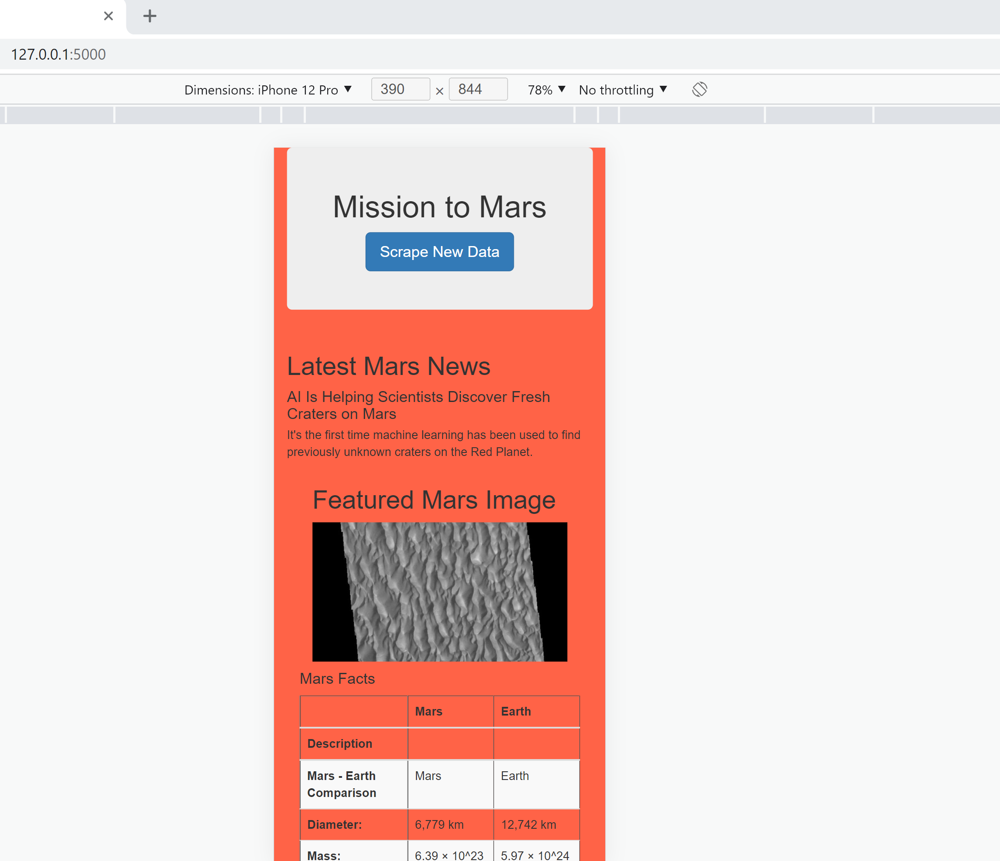
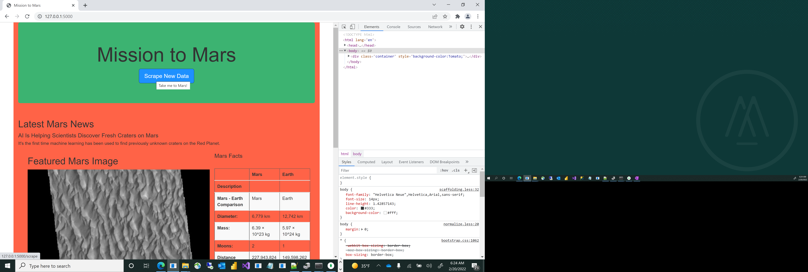

# Mission-to-Mars:  By David Matheny, Date: 2/20/2022

# Background:
Robin's web app is looking good and functioning well, but she wants to add more polish to it. She had been admiring images of Mars’s hemispheres online and realized that the site is scraping-friendly. She would like to adjust the current web app to include all four of the hemisphere images. To do this, you’ll use BeautifulSoup and Splinter to scrape full-resolution images of Mars’s hemispheres and the titles of those images, store the scraped data on a Mongo database, use a web application to display the data, and alter the design of the web app to accommodate these images.

## Deliverable 1: Scrape Full-Resolution Mars Hemisphere Images and Titles
### Below is an image of the hemisphere_image_urls

## Deliverable 2: Update the Web App with Mars Hemisphere Images and Titles.  
### Below are two images.  THe first is webpage with the tiles and images of Mars.  The second is picture of the data saved in the Mongo database.

## Deliverable 3: Add Bootstrap 3 Components
### Below is picture of the mobile-responsive, the other is all the additional components I added. For example color, tooltips and fluid container

